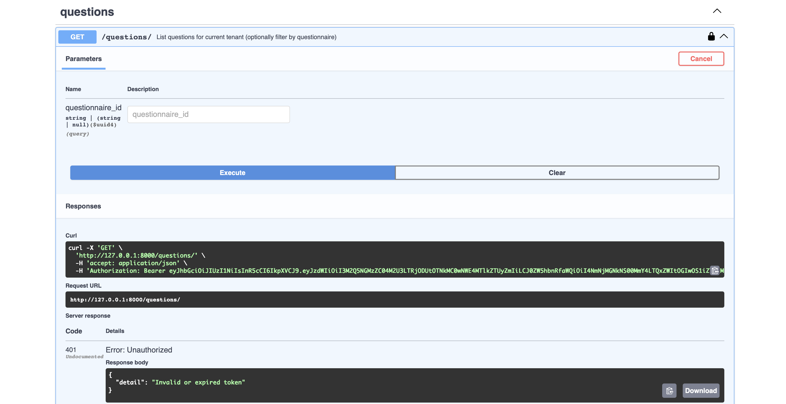

# API Testing Demo – Mini DDQ App (FastAPI Multi-Tenant API)

This document records manual API testing for the **Mini DDQ App**, a FastAPI-based, PostgreSQL-backed multi-tenant Question–Response system.  
All endpoints were tested locally through **Swagger UI** (`http://127.0.0.1:8000/docs`) using seeded tenant and user data.

---

## Overview

| Category | Description |
|:--|:--|
| **Framework** | FastAPI |
| **Environment** | Local (`uvicorn mini_ddq_app.main:app --reload`) |
| **Database** | PostgreSQL (multi-tenant schema via `tenant_id`) |
| **Migrations** | Alembic (`alembic -c mini_ddq_app/alembic.ini upgrade head`) |
| **Key Endpoints** | `/auth/login`, `/questions`, `/responses`, `/imports/questions`, `/search` |
| **Assets Folder** | `sandbox/mini_ddq_app/assets/` |
| **Testing Goal** | Validate authentication, CRUD, import, and search functionality |

---

## Test Setup

1. **Start the API**
```bash
   uvicorn mini_ddq_app.main:app --reload
```

2. **Open Swagger UI:** [http://127.0.0.1:8000/docs](http://127.0.0.1:8000/docs)

3. **Use Seeded Credentials:**
   - `alice@alpha.com` (tenant: Alpha)
   - `bob@beta.com` (tenant: Beta)

4. **Screenshots** were captured for each request/response and saved in the `mini_ddq_app/assets/` folder.

---

## Functional Endpoints Tested

### 1. Authentication – `/auth/login`

Authenticate user and obtain JWT token.  

**Expected Response:**  
`200 OK` with valid `access_token`.

**Result:** Successful login for seeded users.


---

### 2. Authorization – Token Verification

Checked route access with and without valid token.  

**Expected Response:**  
- `401 Unauthorized` when missing or invalid token.  
- `200 OK` when authorized.

**Result:** Unauthorized and authorized states verified.


---

### 3. Get Questions – `/questions`

Retrieve all questions for the current tenant.  

**Expected Response:**  
`200 OK` with list of questions scoped to tenant.

**Result:** Tenant-scoped questions retrieved correctly.


---

### 4. Add Answer – `/responses`

**Request:** Submit an answer for a question.  
**Expected Response:** `200 OK` with saved response object.  
**Result:** Response successfully linked to the question.


### 5. Import Questions – `/imports/questions`

**Purpose:** Bulk import questions from a CSV file while testing tenant isolation.

**Scenario:**  
A **Tenant A** user uploads a CSV (`alpha_questions.csv`) containing:
- One row referencing a **Tenant A** questionnaire ID ✅  
- One row referencing a **Tenant B** questionnaire ID ❌  

**Expected Behavior:**  
Only the row belonging to Tenant A should succeed; cross-tenant data should be rejected.

**Result:** ✅ Import correctly processed tenant-owned data and rejected the other row.

  


### 6. Search – `/search`

**Purpose:** Verify text search returns tenant-scoped results.  

**Request:** Search for keyword `"backup"` across both **questions** and **responses** within the current tenant (`scope=all`).  

**Expected Response:**  
`200 OK` with all matching question–response pairs limited to 50 results.

**Result:** ✅ Returned both the matching **question** and its corresponding **response** containing the keyword “backup.”

  


## Validation & Error Handling Tests

### 1. Missing Token – Unauthorized Access

**Scenario:** Tried accessing a protected route (`GET /questions`) without providing an access token.  
**Expected Result:** `401 Unauthorized` with `"Not authenticated"` message.  
**Result:** ✅ Passed — API correctly rejects unauthenticated requests.


---

### 2. Invalid Token – Corrupted or Expired Token

**Scenario:** Sent a malformed or tampered token in the `Authorization` header.  
**Expected Result:** `401 Unauthorized` with `"Invalid token"` message.  
**Result:** ✅ Passed — Invalid tokens are detected and rejected properly.



---

### 3. Invalid CSV Columns – Import Validation Error

**Scenario:** Uploaded a malformed CSV (`bad_questions.csv`) missing required headers such as `questionnaire_id` and `text`.  
**Expected Result:** Validation error JSON showing failed rows and specific error messages.  
**Result:** ✅ Passed — API returned structured validation errors indicating invalid import format.

  
